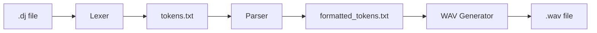

# DJcode

DJcode is a specialized music pattern generation language that allows you to create drum and musical patterns using a simple, intuitive syntax. The system processes .dj files through a pipeline of lexical analysis, parsing, and sound synthesis to generate WAV audio files.

## Project Flow



## Project Structure

### Lexer_Parser/
- `lexer.l`: Flex lexer specification for tokenizing .dj files
- `main.c`: Main program for the lexer
- `parser.py`: Python script for semantic parsing
- `transform_tokens.py`: Token transformation utility
- `test.dj`: Example DJcode file

### Sound_Synthesis/
- `WAVGenerator.h/c`: WAV file generation and audio buffer management
- `soundwaves.h/c`: Sound synthesis algorithms for various instruments
- `tokensParser.h/c`: Parser for formatted tokens to audio commands

## Dependencies

- **Flex**: Required for lexical analysis (`sudo apt-get install flex` on Ubuntu)
- **Python 3**: Required for token transformation and parsing
- **GCC**: Required for C compilation
- **Math Library**: Required for sound synthesis (-lm)

## Build Instructions

### Complete Build
```bash
make all
```
This will run the complete pipeline: lexer → transform → parse → sound generation

### Individual Components

#### Build Lexer Only
```bash
make lexer
```

#### Run Lexer on Input File
```bash
make transform
```

#### Run Parser
```bash
make parse
```

#### Build Sound Generator Only
```bash
make soundgen
```

### Clean Build
```bash
make clean
```

## Usage Instructions

### Writing .dj Files
DJcode files use a simple pattern-based syntax:

```
Pattern1: 
Drum boom
Triangle dididing

Pattern2: 
Drum boom clap tsst
Triangle ding diding

Drop the beat:
Play Pattern1 x2
Play Pattern2 x3
```

Available sounds:
- Drums: boom, clap, tsst, crash, dun
- Triangle: ding, diding, dididing
- Special: rest (silence)

### Running the Complete Pipeline

1. Create your .dj file (e.g., `test.dj`) 
2. Run the complete pipeline:  -----  Change the following line in the makefile if your DJCODE name or path is changed "DJCODE_INPUT = $(LEXER_DIR)/test.dj"
   ```bash
   make all
   ```
3. Find your generated WAV file in the project directory

### Testing Individual Components

#### Test Lexer Output
```bash
./Lexer_Parser/lexer test.dj > tokens.txt
```

#### Test Parser Output
```bash
cd Lexer_Parser && python3 parser.py
```

#### Test Sound Generator
```bash
cd Sound_Synthesis && ./dj_generator
```

## File Dependencies

1. `.dj file` → `lexer.l` + `main.c`
   - Processes the input file into tokens

2. `tokens.txt` → `transform_tokens.py`
   - Transforms raw tokens into a structured format

3. `formatted_tokens.txt` → `tokensParser.h/c`
   - Parses formatted tokens into sound generation commands

4. Sound Generation Chain:
   - `tokensParser.h/c` → `WAVGenerator.h/c` → `soundwaves.h/c`
   - Converts parsed commands into actual sound waves and WAV file

## Error Handling

- The lexer will report syntax errors in .dj files
- The parser validates pattern definitions and play commands
- The sound generator checks for valid sound names and parameter ranges

## Compilation Flags

The project uses strict compilation flags for high-quality C code:
- `-Wall`: Enable all warnings
- `-Werror`: Treat warnings as errors
- `-ansi`: Enforce ANSI C compliance
- `-pedantic`: Enforce strict ISO C compliance
- `-lm`: Link math library
